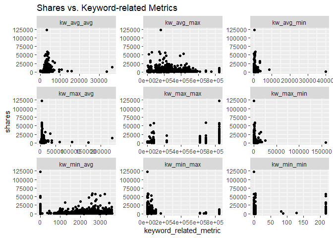

ST558 Porject 2 - Analysis of News Channel: entertainment
================
Bridget Knapp and Chien-Lan Hsueh
2022-07-10

This analysis report focuses on new channel: `entertainment`:

``` r
# subset by channel
if(params$channel != "all"){
  df_train_x <- df_train %>% filter(channel == params$channel)
  df_test_x <- df_test %>% filter(channel == params$channel)
}
```

# Summarizations

## News Channel: `entertainment`

In this section, a quick EDA will be done on the **training set** for
news channel `entertainment`:

-   Overlook of the data set
-   Response variable
-   Categorical Predictors
-   Numeric Predictors

### Overlook of the data set

Verify the data sets only has data from `entertainment` channel:

``` r
table(df_train_x$channel, df_train_x$weekday)
```

    ##                
    ##                 sunday monday tuesday wednesday thursday friday saturday
    ##   bus                0      0       0         0        0      0        0
    ##   entertainment    378    931     893       893      868    668      276
    ##   lifestyle          0      0       0         0        0      0        0
    ##   misc               0      0       0         0        0      0        0
    ##   socmed             0      0       0         0        0      0        0
    ##   tech               0      0       0         0        0      0        0
    ##   world              0      0       0         0        0      0        0

``` r
table(df_test_x$channel, df_test_x$weekday)
```

    ##                
    ##                 sunday monday tuesday wednesday thursday friday saturday
    ##   bus                0      0       0         0        0      0        0
    ##   entertainment    158    427     392       402      363    304      104
    ##   lifestyle          0      0       0         0        0      0        0
    ##   misc               0      0       0         0        0      0        0
    ##   socmed             0      0       0         0        0      0        0
    ##   tech               0      0       0         0        0      0        0
    ##   world              0      0       0         0        0      0        0

The tables below give quick summaries of all the numeric and categorical
variables:

``` r
# quick summaries of numeric and categorical variables
skim(df_train_x)
```

|                                                  |            |
|:-------------------------------------------------|:-----------|
| Name                                             | df_train_x |
| Number of rows                                   | 4907       |
| Number of columns                                | 48         |
| \_\_\_\_\_\_\_\_\_\_\_\_\_\_\_\_\_\_\_\_\_\_\_   |            |
| Column type frequency:                           |            |
| factor                                           | 3          |
| numeric                                          | 45         |
| \_\_\_\_\_\_\_\_\_\_\_\_\_\_\_\_\_\_\_\_\_\_\_\_ |            |
| Group variables                                  | None       |

Data summary

**Variable type: factor**

| skim_variable | n_missing | complete_rate | ordered | n_unique | top_counts                             |
|:--------------|----------:|--------------:|:--------|---------:|:---------------------------------------|
| channel       |         0 |             1 | FALSE   |        1 | ent: 4907, bus: 0, lif: 0, mis: 0      |
| weekday       |         0 |             1 | FALSE   |        7 | mon: 931, tue: 893, wed: 893, thu: 868 |
| is_weekend    |         0 |             1 | FALSE   |        2 | N: 4253, Y: 654                        |

**Variable type: numeric**

| skim_variable                | n_missing | complete_rate |      mean |        sd |    p0 |       p25 |       p50 |       p75 |      p100 | hist  |
|:-----------------------------|----------:|--------------:|----------:|----------:|------:|----------:|----------:|----------:|----------:|:------|
| shares                       |         0 |             1 |   2899.91 |   7896.92 | 47.00 |    837.50 |   1200.00 |   2100.00 | 210300.00 | ▇▁▁▁▁ |
| n_tokens_title               |         0 |             1 |     10.99 |      2.07 |  4.00 |     10.00 |     11.00 |     12.00 |     18.00 | ▁▃▇▃▁ |
| n_tokens_content             |         0 |             1 |    607.29 |    533.57 |  0.00 |    254.00 |    433.00 |    798.50 |   6505.00 | ▇▁▁▁▁ |
| n_unique_tokens              |         0 |             1 |      0.68 |     10.00 |  0.00 |      0.47 |      0.54 |      0.62 |    701.00 | ▇▁▁▁▁ |
| n_non_stop_words             |         0 |             1 |      1.18 |     14.86 |  0.00 |      1.00 |      1.00 |      1.00 |   1042.00 | ▇▁▁▁▁ |
| n_non_stop_unique_tokens     |         0 |             1 |      0.80 |      9.27 |  0.00 |      0.63 |      0.69 |      0.76 |    650.00 | ▇▁▁▁▁ |
| num_hrefs                    |         0 |             1 |     10.61 |     12.28 |  0.00 |      4.00 |      7.00 |     13.00 |    186.00 | ▇▁▁▁▁ |
| num_self_hrefs               |         0 |             1 |      3.52 |      3.22 |  0.00 |      1.00 |      3.00 |      5.00 |     40.00 | ▇▁▁▁▁ |
| num_imgs                     |         0 |             1 |      6.28 |     11.55 |  0.00 |      1.00 |      1.00 |      8.00 |    101.00 | ▇▁▁▁▁ |
| num_videos                   |         0 |             1 |      2.55 |      6.16 |  0.00 |      0.00 |      1.00 |      1.00 |     74.00 | ▇▁▁▁▁ |
| average_token_length         |         0 |             1 |      4.48 |      0.82 |  0.00 |      4.42 |      4.58 |      4.75 |      7.70 | ▁▁▇▇▁ |
| num_keywords                 |         0 |             1 |      6.90 |      1.90 |  2.00 |      5.00 |      7.00 |      8.00 |     10.00 | ▁▆▅▇▆ |
| kw_min_min                   |         0 |             1 |     20.92 |     63.27 | -1.00 |     -1.00 |     -1.00 |      4.00 |    294.00 | ▇▁▁▁▁ |
| kw_max_min                   |         0 |             1 |   1095.46 |   3863.97 |  0.00 |    417.00 |    597.00 |    924.00 | 138700.00 | ▇▁▁▁▁ |
| kw_avg_min                   |         0 |             1 |    293.02 |    756.82 | -1.00 |    123.50 |    208.67 |    325.40 |  34855.12 | ▇▁▁▁▁ |
| kw_min_max                   |         0 |             1 |  13282.45 |  33906.48 |  0.00 |      0.00 |   1500.00 |  11600.00 | 210300.00 | ▇▁▁▁▁ |
| kw_max_max                   |         0 |             1 | 767032.18 | 196260.98 |  0.00 | 843300.00 | 843300.00 | 843300.00 | 843300.00 | ▁▁▁▁▇ |
| kw_avg_max                   |         0 |             1 | 243846.43 | 107908.48 |  0.00 | 179018.89 | 233380.00 | 304532.14 | 651714.29 | ▂▇▅▁▁ |
| kw_min_avg                   |         0 |             1 |   1130.66 |   1110.35 |  0.00 |      0.00 |   1063.00 |   2069.96 |   3285.44 | ▇▂▃▃▂ |
| kw_max_avg                   |         0 |             1 |   5603.54 |   5169.59 |  0.00 |   3657.38 |   4438.32 |   5990.28 | 138700.00 | ▇▁▁▁▁ |
| kw_avg_avg                   |         0 |             1 |   3148.87 |   1138.13 |  0.00 |   2553.90 |   2963.08 |   3541.38 |  36023.42 | ▇▁▁▁▁ |
| self_reference_min_shares    |         0 |             1 |   2697.27 |   7442.36 |  0.00 |    702.50 |   1100.00 |   2000.00 | 210300.00 | ▇▁▁▁▁ |
| self_reference_max_shares    |         0 |             1 |   8841.70 |  27118.05 |  0.00 |   1100.00 |   2700.00 |   9100.00 | 837700.00 | ▇▁▁▁▁ |
| self_reference_avg_sharess   |         0 |             1 |   4967.52 |  11067.21 |  0.00 |   1024.00 |   2033.33 |   4805.92 | 281685.00 | ▇▁▁▁▁ |
| LDA_00                       |         0 |             1 |      0.07 |      0.09 |  0.00 |      0.03 |      0.03 |      0.05 |      0.79 | ▇▁▁▁▁ |
| LDA_01                       |         0 |             1 |      0.43 |      0.32 |  0.00 |      0.04 |      0.45 |      0.73 |      0.93 | ▇▂▃▃▆ |
| LDA_02                       |         0 |             1 |      0.09 |      0.13 |  0.00 |      0.03 |      0.03 |      0.05 |      0.79 | ▇▁▁▁▁ |
| LDA_03                       |         0 |             1 |      0.35 |      0.34 |  0.00 |      0.03 |      0.25 |      0.70 |      0.92 | ▇▂▂▂▅ |
| LDA_04                       |         0 |             1 |      0.06 |      0.09 |  0.00 |      0.03 |      0.03 |      0.04 |      0.74 | ▇▁▁▁▁ |
| global_subjectivity          |         0 |             1 |      0.45 |      0.11 |  0.00 |      0.41 |      0.46 |      0.51 |      1.00 | ▁▂▇▁▁ |
| global_sentiment_polarity    |         0 |             1 |      0.11 |      0.10 | -0.38 |      0.05 |      0.11 |      0.17 |      0.73 | ▁▃▇▁▁ |
| global_rate_positive_words   |         0 |             1 |      0.04 |      0.02 |  0.00 |      0.03 |      0.04 |      0.05 |      0.15 | ▃▇▁▁▁ |
| global_rate_negative_words   |         0 |             1 |      0.02 |      0.01 |  0.00 |      0.01 |      0.02 |      0.03 |      0.09 | ▇▅▁▁▁ |
| rate_positive_words          |         0 |             1 |      0.67 |      0.19 |  0.00 |      0.58 |      0.69 |      0.79 |      1.00 | ▁▁▃▇▃ |
| rate_negative_words          |         0 |             1 |      0.31 |      0.16 |  0.00 |      0.20 |      0.30 |      0.41 |      1.00 | ▅▇▃▁▁ |
| avg_positive_polarity        |         0 |             1 |      0.37 |      0.11 |  0.00 |      0.32 |      0.37 |      0.42 |      1.00 | ▁▇▅▁▁ |
| min_positive_polarity        |         0 |             1 |      0.09 |      0.06 |  0.00 |      0.05 |      0.10 |      0.10 |      1.00 | ▇▁▁▁▁ |
| max_positive_polarity        |         0 |             1 |      0.80 |      0.25 |  0.00 |      0.60 |      0.85 |      1.00 |      1.00 | ▁▁▃▃▇ |
| avg_negative_polarity        |         0 |             1 |     -0.30 |      0.13 | -1.00 |     -0.37 |     -0.30 |     -0.22 |      0.00 | ▁▁▂▇▂ |
| min_negative_polarity        |         0 |             1 |     -0.59 |      0.30 | -1.00 |     -0.80 |     -0.60 |     -0.40 |      0.00 | ▇▅▇▂▃ |
| max_negative_polarity        |         0 |             1 |     -0.11 |      0.10 | -1.00 |     -0.12 |     -0.10 |     -0.05 |      0.00 | ▁▁▁▁▇ |
| title_subjectivity           |         0 |             1 |      0.32 |      0.33 |  0.00 |      0.00 |      0.30 |      0.52 |      1.00 | ▇▂▃▂▂ |
| title_sentiment_polarity     |         0 |             1 |      0.07 |      0.28 | -1.00 |      0.00 |      0.00 |      0.19 |      1.00 | ▁▁▇▂▁ |
| abs_title_subjectivity       |         0 |             1 |      0.32 |      0.19 |  0.00 |      0.12 |      0.40 |      0.50 |      0.50 | ▅▂▂▁▇ |
| abs_title_sentiment_polarity |         0 |             1 |      0.17 |      0.23 |  0.00 |      0.00 |      0.08 |      0.30 |      1.00 | ▇▂▁▁▁ |

### Response Variable

Next, let’s learn more about our response variable: `shares` with a
5-number summary. With a histogram, we can visually see it’s
distribution and determine if it is symmetric, skewed left, or skewed
right.

``` r
# 5-number summary on shares
summary(df_train_x$shares)
```

    ##     Min.  1st Qu.   Median     Mean  3rd Qu.     Max. 
    ##     47.0    837.5   1200.0   2899.9   2100.0 210300.0

``` r
# histogram on shares
df_train_x %>% 
  ggplot(aes(x = shares)) + 
  geom_histogram(binwidth = 1000) +
  coord_cartesian(xlim = c(0, 100000)) +
  labs(
    title = paste0("Histogram: Distribution of Shares for News Channel ", params$channel),
    x="Shares",
    y="Frequency")
```

<!-- -->

### Categorical Predictors

Despite the `channel` variable, there are two categorical variables
`weekday`, `is_weekend`. A one-way contigency table shows how many
articles were published on each weekday.

``` r
df_train_x %>% 
  select(weekday, is_weekend) %>% 
  summary()
```

    ##       weekday    is_weekend
    ##  sunday   :378   N:4253    
    ##  monday   :931   Y: 654    
    ##  tuesday  :893             
    ##  wednesday:893             
    ##  thursday :868             
    ##  friday   :668             
    ##  saturday :276

The following side-by-side box plots help us visualize the distributions
of `shares` on each weekday.

``` r
df_train_x %>% 
  ggplot(aes(weekday, shares)) +
  geom_boxplot() +
  scale_y_log10() +
  geom_jitter(width = 0.05) +
  labs(
    title = paste0("Boxplots: Distribution of Shares in News Channel ", params$channel, " for Each Weekday"),
    x = "Weekday")
```

<!-- -->

### Numeric Predictors

We have 45 numeric variables. To further investigate the relationship
among these numeric variables, we check their correlation by making
pair-wise correlation plots.

``` r
ggcorrplot(
  cor(select_if(df_train_x, is.numeric), use = "complete.obs"), 
  hc.order = TRUE, 
  type = "lower",
  tl.cex = 6,
  title = paste0("Correlation Plot for News Channel ", params$channel))
```

<!-- -->

Below, we use scatter plots to inspect the relationship between the
response variable `shares` and various numeric variables in related
groups:

-   `shares` vs. token-related variables
-   `shares` vs. numbers of links, keyword, images, videos
-   `shares` vs. keyword-related metrics
-   `shares` vs. tone polarity metrics
-   `shares` vs. title-related metrics

#### `shares` vs. Token-related Variables

``` r
# scatter plots: shares vs. token-related variables
df_train_x %>% 
  select(shares, starts_with("n_"), contains("token")) %>% 
  pivot_longer(
    cols = -c(shares),
    names_to = "token_metric",
    values_to = "number_of_tokens") %>% 
  ggplot(aes(number_of_tokens, shares)) +
  geom_point() +
  facet_wrap(vars(token_metric), scales = "free") +
  ggtitle("Shares vs. Token-related Variables")
```

<!-- -->

#### `shares` vs. numbers of links, keywords, images and videos

``` r
# scatter plots: shares vs. numbers of links, keywords, images and videos
df_train_x %>% 
  select(shares, starts_with("num_"), starts_with("self_reference")) %>% 
  pivot_longer(
    cols = -c(shares),
    names_to = "number_metric",
    values_to = "number_of_links_keywords_images_videos") %>% 
  ggplot(aes(number_of_links_keywords_images_videos, shares)) +
  geom_point() +
  facet_wrap(vars(number_metric), scales = "free") +
  ggtitle("Shares vs. Numbers of Links, Keywords, Images and Videos")
```

<!-- -->

#### `shares` vs. Keyword-related Metrics

``` r
# scatter plots: shares vs. numbers of links, keywords, images and videos
df_train_x %>% 
  select(shares, starts_with("kw_")) %>% 
  pivot_longer(
    cols = -c(shares),
    names_to = "number_metric",
    values_to = "keyword_related_metric") %>% 
  ggplot(aes(keyword_related_metric, shares)) +
  geom_point() +
  facet_wrap(vars(number_metric), scales = "free") +
  ggtitle("Shares vs. Keyword-related Metrics")
```

<!-- -->

#### `shares` vs. Word Polarity Metrics

``` r
# scatter plots: shares vs. numbers of links, keywords, images and videos
df_train_x %>% 
  select(
    shares, 
    contains("subjectivity"), 
    contains("polarity"), 
    contains("positive"), 
    contains("negative"),
    -contains("title")) %>% 
  pivot_longer(
    cols = -c(shares),
    names_to = "number_metric",
    values_to = "tone_polarity") %>% 
  ggplot(aes(tone_polarity, shares)) +
  geom_point() +
  facet_wrap(vars(number_metric), scales = "free") +
  ggtitle("Shares vs. Word Polarity Metrics")
```

<!-- -->

#### `shares` vs. Title-related Metrics

``` r
# scatter plots: shares vs. numbers of links, keywords, images and videos
df_train_x %>% 
  select(shares, contains("title")) %>% 
  pivot_longer(
    cols = -c(shares),
    names_to = "number_metric",
    values_to = "title_related_metric") %>% 
  ggplot(aes(title_related_metric, shares)) +
  geom_point() +
  facet_wrap(vars(number_metric), scales = "free") +
  ggtitle("Shares vs. Title-related Metrics")
```

<!-- -->

# Modeling

## Modeling Formula

In this project, we model the response `shares` using supervised
learning including linear regression, random forests and boosted tree
models. Based on the EDA, we decide to use the following subsets of
predictors in each learning method:

-   Model A: `shares` \~ `weekday` (categorical) + numbers of various
    tokens, words, links, images and video (numeric)
-   Model B: `shares` \~ `is_weekend` (categorical) + all numeric
    predictors (numeric)

``` r
# Model A: `weekday` (categorical) + selected numeric predictors
vars_A <- c(1, 3, 5:15)
names(df_train_x)[vars_A]
```

    ##  [1] "shares"                   "weekday"                  "n_tokens_title"           "n_tokens_content"        
    ##  [5] "n_unique_tokens"          "n_non_stop_words"         "n_non_stop_unique_tokens" "num_hrefs"               
    ##  [9] "num_self_hrefs"           "num_imgs"                 "num_videos"               "average_token_length"    
    ## [13] "num_keywords"

``` r
# Model B: `is_weekend` (categorical) + all numeric predictors
vars_B <- c(1, 4, 5:48)
names(df_train_x)[vars_B]
```

    ##  [1] "shares"                       "is_weekend"                   "n_tokens_title"               "n_tokens_content"            
    ##  [5] "n_unique_tokens"              "n_non_stop_words"             "n_non_stop_unique_tokens"     "num_hrefs"                   
    ##  [9] "num_self_hrefs"               "num_imgs"                     "num_videos"                   "average_token_length"        
    ## [13] "num_keywords"                 "kw_min_min"                   "kw_max_min"                   "kw_avg_min"                  
    ## [17] "kw_min_max"                   "kw_max_max"                   "kw_avg_max"                   "kw_min_avg"                  
    ## [21] "kw_max_avg"                   "kw_avg_avg"                   "self_reference_min_shares"    "self_reference_max_shares"   
    ## [25] "self_reference_avg_sharess"   "LDA_00"                       "LDA_01"                       "LDA_02"                      
    ## [29] "LDA_03"                       "LDA_04"                       "global_subjectivity"          "global_sentiment_polarity"   
    ## [33] "global_rate_positive_words"   "global_rate_negative_words"   "rate_positive_words"          "rate_negative_words"         
    ## [37] "avg_positive_polarity"        "min_positive_polarity"        "max_positive_polarity"        "avg_negative_polarity"       
    ## [41] "min_negative_polarity"        "max_negative_polarity"        "title_subjectivity"           "title_sentiment_polarity"    
    ## [45] "abs_title_subjectivity"       "abs_title_sentiment_polarity"

The learning methods we use in this project include linger regression,
random forests and boosted tree models. For each, we will use a 5-fold
cross validation without repeats (for computational ease) to choose the
best model. By default in `caret package`, the metric is RMSE.

### Linear Regression Model

A linear regression models the relationship between a response and
predictors with a linear predictor functions. The model parameters are
estimated from the data by minimizing a loss function. One of the common
loss function is root mean squared error (RMSE) which is the standard
deviation of the prediction errors (residuals).

We fit both model A and B using the training data and compare their
performance on the training set using 5-fold cross-validation. The best
model is then used to predict on the test set to evaluate the model
performance.

``` r
# linear regression models

# Model A: `weekday` (categorical) + selected numeric predictors
fit_lm_A <- fit_model(
  shares ~ ., df_train_x[, vars_A], df_test_x[, vars_A], method = "lm",
  trControl = trainControl(method = "cv", number = 5))
```

    ##    user  system elapsed 
    ##    0.53    0.00    0.60 
    ## [1] "No tuning parameter"
    ## [1] "Performance metrics:"
    ##         RMSE     Rsquared          MAE 
    ## 7.734238e+03 9.139816e-03 3.039017e+03

``` r
# Model B: `is_weekend` (categorical) + all numeric predictors
fit_lm_B <- fit_model(
  shares ~ ., df_train_x[, vars_B], df_test_x[, vars_B], method = "lm",
  trControl = trainControl(method = "cv", number = 5))
```

    ##    user  system elapsed 
    ##    0.65    0.08    0.74 
    ## [1] "No tuning parameter"
    ## [1] "Performance metrics:"
    ##         RMSE     Rsquared          MAE 
    ## 7.677336e+03 2.720152e-02 2.997301e+03

### Random Forests Model

Random forests is also known as random decision forests model. It is an
ensemble method based on decision trees. It uses bagging to create
multiple trees from bootstrap samples and aggregate the results to make
decisions. However, instead of all predictors, only a subset of the
predictors are used to grow trees. This effectively prevents highly
correlated trees if there exists a strong predictor. Again, 5-fold cross
validation is used to choose the best model. Note that:

-   We can include hyperparameter tuning, for example
    `tuneGrid = expand.grid(mtry = 1:20)`
-   In addition to `randomForest` package, we also use `ranger` package
    and tune the following parameters:
    -   mtry: number of variables randomly sampled as candidates at each
        split
    -   splitrule: since this is for regression, we choose “variance”
        option to use variance as our splitting rule
    -   min.node.size: minimum number of observations in each node

``` r
# random forest models
# Model A: `weekday` (categorical) + selected numeric predictors
fit_rf_A <- fit_model(
  shares ~ ., df_train_x[, vars_A], df_test_x[, vars_A], method = "rf",
  trControl = trainControl(method = "cv", number = 5),
  tuneGrid = expand.grid(mtry = 1:16))
```

    ##    user  system elapsed 
    ## 1634.14    3.97 1641.27 
    ## [1] "The best tune is found with:"
    ##  mtry = 1
    ## [1] "Performance metrics:"
    ##         RMSE     Rsquared          MAE 
    ## 7.745704e+03 6.486910e-03 3.010689e+03

``` r
# Model B: `is_weekend` (categorical) + all numeric predictors
fit_rf_B <- fit_model(
  shares ~ ., df_train_x[, vars_B], df_test_x[, vars_B], method = "rf",
  trControl = trainControl(method = "cv", number = 5),
  tuneGrid = expand.grid(mtry = 1:16))
```

    ##    user  system elapsed 
    ## 2042.40    4.40 2048.56 
    ## [1] "The best tune is found with:"
    ##  mtry = 1
    ## [1] "Performance metrics:"
    ##         RMSE     Rsquared          MAE 
    ## 7.625663e+03 3.880963e-02 3.005795e+03

``` r
# random forests models (using ranger)
# Model A: `weekday` (categorical) + selected numeric predictors
fit_ranger_A <- fit_model(
  shares ~ ., df_train_x[, vars_A], df_test_x[, vars_A], method = "ranger",
  trControl = trainControl(method = "cv", number = 5),
  tuneGrid = expand.grid(
    mtry = 1:16,
    splitrule = "variance",
    min.node.size = c(5, 10, 15, 20)
  ))
```

    ##    user  system elapsed 
    ## 1869.92    4.53  265.51 
    ## [1] "The best tune is found with:"
    ##  mtry = 1
    ##  splitrule = 1
    ##  min.node.size = 20
    ## [1] "Performance metrics:"
    ##         RMSE     Rsquared          MAE 
    ## 7.750944e+03 5.061811e-03 3.024461e+03

``` r
# Model B: `is_weekend` (categorical) + all numeric predictors
fit_ranger_B <- fit_model(
  shares ~ ., df_train_x[, vars_B], df_test_x[, vars_B], method = "ranger",
  trControl = trainControl(method = "cv", number = 5),
  tuneGrid = expand.grid(
    mtry = 1:16,
    splitrule = "variance",
    min.node.size = c(5, 10, 15, 20)
  ))
```

    ##    user  system elapsed 
    ## 3141.97    5.08  441.70 
    ## [1] "The best tune is found with:"
    ##  mtry = 1
    ##  splitrule = 1
    ##  min.node.size = 20
    ## [1] "Performance metrics:"
    ##         RMSE     Rsquared          MAE 
    ## 7.624948e+03 4.149584e-02 2.990263e+03

### Boosted Tree Model

Last, we try boosted tree models in which trees are grown sequentially.
Each subsequent tree is grown on a modified version of the original tree
and thus the prediction is updated as the tree grown.

We use 5-fold cross validation to determine the best parameters.

``` r
# boosted tree models

# Model A: `weekday` (categorical) + selected numeric predictors
fit_boosted_A <- fit_model(
  shares ~ ., df_train_x[, vars_A], df_test_x[, vars_A], method = "gbm",
  trControl = trainControl(method = "cv", number = 5),
  tuneGrid = expand.grid(
    n.trees = seq(5, 200, 5),
    interaction.depth = 1:4,
    shrinkage = 0.1,
    n.minobsinnode =10),
  verbose = FALSE)
```

    ##    user  system elapsed 
    ##    8.25    0.04    8.30 
    ## [1] "The best tune is found with:"
    ##  n.trees = 5
    ##  interaction.depth = 1
    ##  shrinkage = 0.1
    ##  n.minobsinnode = 10
    ## [1] "Performance metrics:"
    ##         RMSE     Rsquared          MAE 
    ## 7.770692e+03 1.770225e-04 3.056719e+03

``` r
# Model B: `is_weekend` (categorical) + all numeric predictors
fit_boosted_B <- fit_model(
  shares ~ ., df_train_x[, vars_B], df_test_x[, vars_B], method = "gbm",
  trControl = trainControl(method = "cv", number = 5),
  tuneGrid = expand.grid(
    n.trees = seq(5, 200, 5),
    interaction.depth = 1:4,
    shrinkage = 0.1,
    n.minobsinnode =10),
  verbose = FALSE)
```

    ##    user  system elapsed 
    ##   19.92    0.06   19.99 
    ## [1] "The best tune is found with:"
    ##  n.trees = 5
    ##  interaction.depth = 4
    ##  shrinkage = 0.1
    ##  n.minobsinnode = 10
    ## [1] "Performance metrics:"
    ##         RMSE     Rsquared          MAE 
    ## 7721.8967533    0.0130377 3013.2098800

## Comparison

We use RMSE to compare the model performance on the test set:

``` r
df_comparison <- tibble(
    Linear_Regression = c(fit_lm_A["RMSE"], fit_lm_B["RMSE"]),
    Random_Forests = c(fit_rf_A["RMSE"], fit_rf_B["RMSE"]),
    Random_Forests_ranger = c(fit_ranger_A["RMSE"], fit_ranger_B["RMSE"]),
    Boosted_Tree = c(fit_boosted_A["RMSE"], fit_boosted_B["RMSE"])
  ) %>%
  bind_cols(model = c("A: shares ~ weekday + selected numeric vars", "B: shares ~ is_weekend + all numeric vars")) %>%
  pivot_longer(
    cols = !model,
    names_to = "learning_method",
    values_to = "RMSE"
  ) %>%
  mutate(
    datetime = now(),
    channel = params$channel
  ) %>%
  relocate(datetime, channel) %>%
  arrange(RMSE)

df_comparison[, -1]
```

    ## # A tibble: 8 x 4
    ##   channel       model                                       learning_method        RMSE
    ##   <chr>         <chr>                                       <chr>                 <dbl>
    ## 1 entertainment B: shares ~ is_weekend + all numeric vars   Random_Forests_ranger 7625.
    ## 2 entertainment B: shares ~ is_weekend + all numeric vars   Random_Forests        7626.
    ## 3 entertainment B: shares ~ is_weekend + all numeric vars   Linear_Regression     7677.
    ## 4 entertainment B: shares ~ is_weekend + all numeric vars   Boosted_Tree          7722.
    ## 5 entertainment A: shares ~ weekday + selected numeric vars Linear_Regression     7734.
    ## 6 entertainment A: shares ~ weekday + selected numeric vars Random_Forests        7746.
    ## 7 entertainment A: shares ~ weekday + selected numeric vars Random_Forests_ranger 7751.
    ## 8 entertainment A: shares ~ weekday + selected numeric vars Boosted_Tree          7771.

For the news data in `entertainment` category, we found that the model
`B: shares ~ is_weekend + all numeric vars` using supervised learning
method `Random_Forests_ranger` has the lowest RMSE of 7624.9479057.

``` r
# save the results
write_csv(
  df_comparison, 
  here("output", "learnings.csv"), 
  append = T)
```
