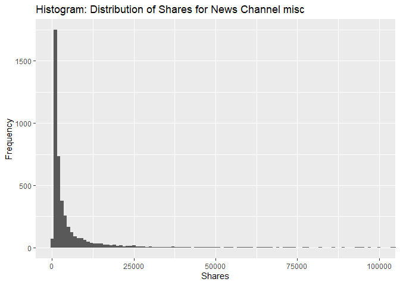
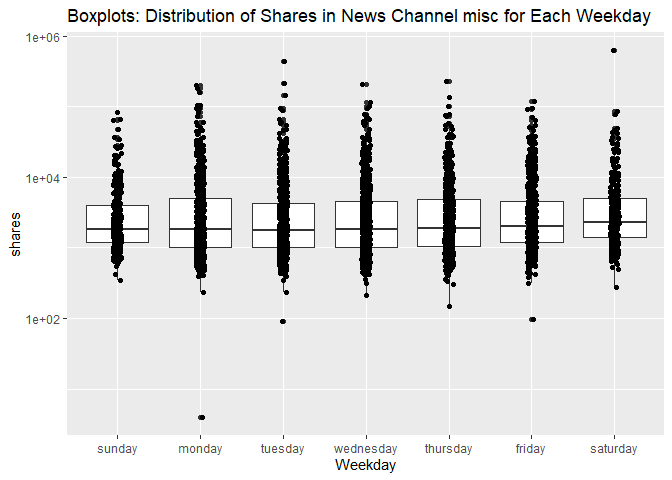
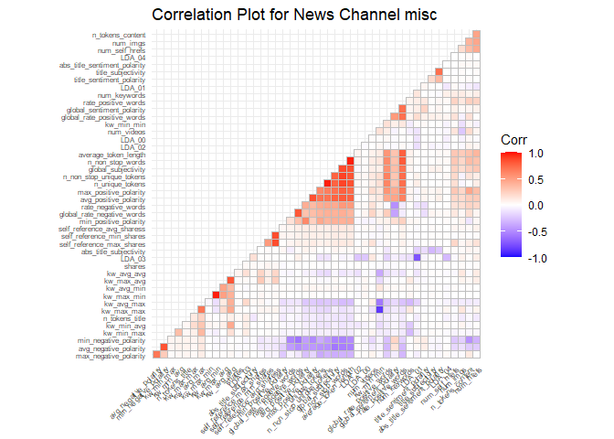
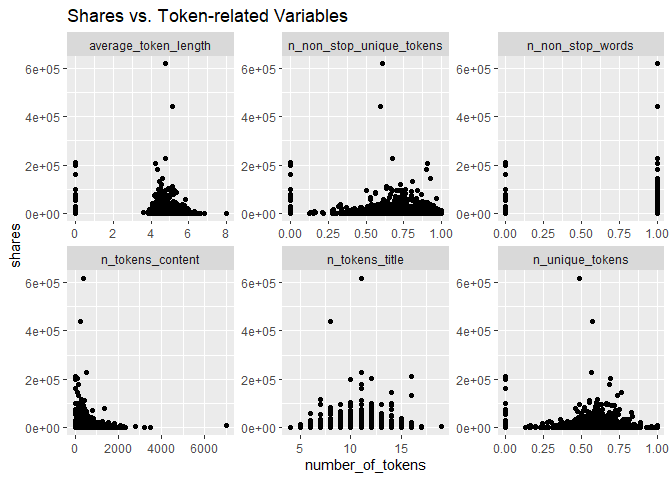
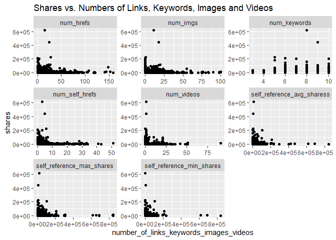
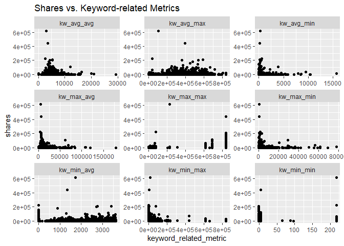
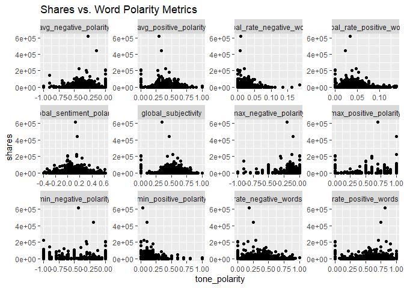
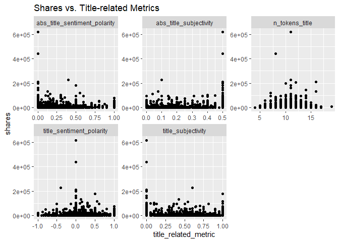

ST558 Porject 2 - Analysis on News Channel: misc
================
Bridget Knapp and Chien-Lan Hsueh
2022-07-10

This analysis report focuses on new channel: `misc`:

``` r
# subset by channel
if(params$channel != "all"){
  df_train_x <- df_train %>% filter(channel == params$channel)
  df_test_x <- df_test %>% filter(channel == params$channel)
}
```

# Summarizations

## News Channel: `misc`

In this section, a quick EDA will be done on the **training set** for
news channel `misc`:

-   Overlook of the data set
-   Response variable
-   Categorical Predictors
-   Numeric Predictors

### Overlook of the data set

Verify the data sets only has data from `misc` channel:

``` r
table(df_train_x$channel, df_train_x$weekday)
```

    ##                
    ##                 sunday monday tuesday wednesday thursday friday saturday
    ##   bus                0      0       0         0        0      0        0
    ##   entertainment      0      0       0         0        0      0        0
    ##   lifestyle          0      0       0         0        0      0        0
    ##   misc             373    629     760       766      787    657      298
    ##   socmed             0      0       0         0        0      0        0
    ##   tech               0      0       0         0        0      0        0
    ##   world              0      0       0         0        0      0        0

``` r
table(df_test_x$channel, df_test_x$weekday)
```

    ##                
    ##                 sunday monday tuesday wednesday thursday friday saturday
    ##   bus                0      0       0         0        0      0        0
    ##   entertainment      0      0       0         0        0      0        0
    ##   lifestyle          0      0       0         0        0      0        0
    ##   misc             175    271     351       317      315    309      126
    ##   socmed             0      0       0         0        0      0        0
    ##   tech               0      0       0         0        0      0        0
    ##   world              0      0       0         0        0      0        0

The tables below give quick summaries of all the numeric and categorical
variables:

``` r
# quick summaries of numeric and categorical variables
skim(df_train_x)
```

|                                                  |            |
|:-------------------------------------------------|:-----------|
| Name                                             | df_train_x |
| Number of rows                                   | 4270       |
| Number of columns                                | 48         |
| \_\_\_\_\_\_\_\_\_\_\_\_\_\_\_\_\_\_\_\_\_\_\_   |            |
| Column type frequency:                           |            |
| factor                                           | 3          |
| numeric                                          | 45         |
| \_\_\_\_\_\_\_\_\_\_\_\_\_\_\_\_\_\_\_\_\_\_\_\_ |            |
| Group variables                                  | None       |

Data summary

**Variable type: factor**

| skim_variable | n_missing | complete_rate | ordered | n_unique | top_counts                             |
|:--------------|----------:|--------------:|:--------|---------:|:---------------------------------------|
| channel       |         0 |             1 | FALSE   |        1 | mis: 4270, bus: 0, ent: 0, lif: 0      |
| weekday       |         0 |             1 | FALSE   |        7 | thu: 787, wed: 766, tue: 760, fri: 657 |
| is_weekend    |         0 |             1 | FALSE   |        2 | N: 3599, Y: 671                        |

**Variable type: numeric**

| skim_variable                | n_missing | complete_rate |      mean |        sd |    p0 |       p25 |       p50 |       p75 |      p100 | hist  |
|:-----------------------------|----------:|--------------:|----------:|----------:|------:|----------:|----------:|----------:|----------:|:------|
| shares                       |         0 |             1 |   5765.47 |  17173.74 |  4.00 |   1100.00 |   1900.00 |   4600.00 | 617900.00 | ▇▁▁▁▁ |
| n_tokens_title               |         0 |             1 |     10.32 |      2.01 |  4.00 |      9.00 |     10.00 |     12.00 |     19.00 | ▁▇▆▁▁ |
| n_tokens_content             |         0 |             1 |    334.25 |    328.96 |  0.00 |    146.00 |    254.50 |    421.00 |   7002.00 | ▇▁▁▁▁ |
| n_unique_tokens              |         0 |             1 |      0.54 |      0.21 |  0.00 |      0.50 |      0.58 |      0.66 |      1.00 | ▂▁▇▇▁ |
| n_non_stop_words             |         0 |             1 |      0.89 |      0.31 |  0.00 |      1.00 |      1.00 |      1.00 |      1.00 | ▁▁▁▁▇ |
| n_non_stop_unique_tokens     |         0 |             1 |      0.63 |      0.24 |  0.00 |      0.61 |      0.69 |      0.77 |      1.00 | ▂▁▂▇▃ |
| num_hrefs                    |         0 |             1 |     13.56 |     14.55 |  0.00 |      4.00 |      9.00 |     19.00 |    158.00 | ▇▁▁▁▁ |
| num_self_hrefs               |         0 |             1 |      2.82 |      3.38 |  0.00 |      1.00 |      2.00 |      3.00 |     51.00 | ▇▁▁▁▁ |
| num_imgs                     |         0 |             1 |      7.66 |     10.56 |  0.00 |      0.00 |      2.00 |     12.00 |    100.00 | ▇▁▁▁▁ |
| num_videos                   |         0 |             1 |      2.68 |      5.92 |  0.00 |      0.00 |      1.00 |      1.00 |     91.00 | ▇▁▁▁▁ |
| average_token_length         |         0 |             1 |      4.23 |      1.49 |  0.00 |      4.41 |      4.63 |      4.88 |      7.97 | ▂▁▇▅▁ |
| num_keywords                 |         0 |             1 |      7.47 |      1.62 |  3.00 |      6.00 |      7.00 |      9.00 |     10.00 | ▁▂▇▃▆ |
| kw_min_min                   |         0 |             1 |     29.55 |     73.35 | -1.00 |     -1.00 |     -1.00 |      4.00 |    217.00 | ▇▁▁▁▁ |
| kw_max_min                   |         0 |             1 |   1328.66 |   3836.74 |  0.00 |    462.25 |    685.00 |   1000.00 |  77800.00 | ▇▁▁▁▁ |
| kw_avg_min                   |         0 |             1 |    327.52 |    600.43 | -1.00 |    145.21 |    225.40 |    342.24 |  15674.60 | ▇▁▁▁▁ |
| kw_min_max                   |         0 |             1 |  21128.98 |  74052.56 |  0.00 |      0.00 |   3200.00 |  16200.00 | 843300.00 | ▇▁▁▁▁ |
| kw_max_max                   |         0 |             1 | 745882.81 | 222791.90 |  0.00 | 843300.00 | 843300.00 | 843300.00 | 843300.00 | ▁▁▁▁▇ |
| kw_avg_max                   |         0 |             1 | 354014.89 | 156752.52 |  0.00 | 269478.57 | 349125.00 | 453852.68 | 843300.00 | ▂▇▇▃▁ |
| kw_min_avg                   |         0 |             1 |   1564.55 |   1369.25 |  0.00 |      0.00 |   1600.00 |   2908.17 |   3609.72 | ▇▂▃▃▆ |
| kw_max_avg                   |         0 |             1 |   8276.02 |   6870.96 |  0.00 |   5861.02 |   7191.95 |   8578.69 | 178675.00 | ▇▁▁▁▁ |
| kw_avg_avg                   |         0 |             1 |   4457.35 |   1434.56 |  0.00 |   3674.96 |   4372.33 |   5082.09 |  29240.82 | ▇▁▁▁▁ |
| self_reference_min_shares    |         0 |             1 |   6604.75 |  24208.52 |  0.00 |    805.00 |   1800.00 |   4800.00 | 843300.00 | ▇▁▁▁▁ |
| self_reference_max_shares    |         0 |             1 |  14564.67 |  47464.45 |  0.00 |   1300.00 |   4100.00 |  13000.00 | 843300.00 | ▇▁▁▁▁ |
| self_reference_avg_sharess   |         0 |             1 |   9877.22 |  28956.09 |  0.00 |   1200.00 |   3400.00 |   9287.50 | 843300.00 | ▇▁▁▁▁ |
| LDA_00                       |         0 |             1 |      0.06 |      0.08 |  0.02 |      0.03 |      0.03 |      0.04 |      0.69 | ▇▁▁▁▁ |
| LDA_01                       |         0 |             1 |      0.14 |      0.19 |  0.02 |      0.03 |      0.03 |      0.20 |      0.92 | ▇▂▁▁▁ |
| LDA_02                       |         0 |             1 |      0.06 |      0.08 |  0.02 |      0.03 |      0.03 |      0.03 |      0.79 | ▇▁▁▁▁ |
| LDA_03                       |         0 |             1 |      0.68 |      0.21 |  0.02 |      0.54 |      0.73 |      0.87 |      0.93 | ▁▁▃▅▇ |
| LDA_04                       |         0 |             1 |      0.06 |      0.09 |  0.02 |      0.03 |      0.03 |      0.04 |      0.64 | ▇▁▁▁▁ |
| global_subjectivity          |         0 |             1 |      0.46 |      0.18 |  0.00 |      0.43 |      0.50 |      0.57 |      1.00 | ▂▁▇▂▁ |
| global_sentiment_polarity    |         0 |             1 |      0.12 |      0.13 | -0.39 |      0.01 |      0.11 |      0.20 |      0.62 | ▁▃▇▃▁ |
| global_rate_positive_words   |         0 |             1 |      0.04 |      0.02 |  0.00 |      0.03 |      0.04 |      0.05 |      0.14 | ▅▇▂▁▁ |
| global_rate_negative_words   |         0 |             1 |      0.02 |      0.01 |  0.00 |      0.01 |      0.02 |      0.03 |      0.18 | ▇▁▁▁▁ |
| rate_positive_words          |         0 |             1 |      0.61 |      0.26 |  0.00 |      0.50 |      0.67 |      0.78 |      1.00 | ▂▁▅▇▃ |
| rate_negative_words          |         0 |             1 |      0.29 |      0.19 |  0.00 |      0.16 |      0.29 |      0.41 |      1.00 | ▆▇▅▁▁ |
| avg_positive_polarity        |         0 |             1 |      0.37 |      0.16 |  0.00 |      0.32 |      0.39 |      0.45 |      1.00 | ▂▇▇▁▁ |
| min_positive_polarity        |         0 |             1 |      0.12 |      0.10 |  0.00 |      0.05 |      0.10 |      0.14 |      1.00 | ▇▁▁▁▁ |
| max_positive_polarity        |         0 |             1 |      0.72 |      0.32 |  0.00 |      0.50 |      0.80 |      1.00 |      1.00 | ▂▁▃▃▇ |
| avg_negative_polarity        |         0 |             1 |     -0.28 |      0.17 | -1.00 |     -0.39 |     -0.30 |     -0.18 |      0.00 | ▁▁▃▇▅ |
| min_negative_polarity        |         0 |             1 |     -0.51 |      0.33 | -1.00 |     -0.71 |     -0.50 |     -0.25 |      0.00 | ▇▇▇▃▇ |
| max_negative_polarity        |         0 |             1 |     -0.13 |      0.13 | -1.00 |     -0.17 |     -0.10 |     -0.05 |      0.00 | ▁▁▁▁▇ |
| title_subjectivity           |         0 |             1 |      0.37 |      0.36 |  0.00 |      0.00 |      0.35 |      0.65 |      1.00 | ▇▂▃▂▃ |
| title_sentiment_polarity     |         0 |             1 |      0.09 |      0.33 | -1.00 |      0.00 |      0.00 |      0.25 |      1.00 | ▁▁▇▃▁ |
| abs_title_subjectivity       |         0 |             1 |      0.33 |      0.19 |  0.00 |      0.15 |      0.43 |      0.50 |      0.50 | ▃▂▂▁▇ |
| abs_title_sentiment_polarity |         0 |             1 |      0.21 |      0.26 |  0.00 |      0.00 |      0.12 |      0.38 |      1.00 | ▇▂▂▁▁ |

### Response Variable

Next, let’s learn more about our response variable: `shares` with a
5-number summary. With a histogram, we can visually see it’s
distribution and determine if it is symmetric, skewed left, or skewed
right.

``` r
# 5-number summary on shares
summary(df_train_x$shares)
```

    ##    Min. 1st Qu.  Median    Mean 3rd Qu.    Max. 
    ##       4    1100    1900    5766    4600  617900

``` r
# histogram on shares
df_train_x %>% 
  ggplot(aes(x = shares)) + 
  geom_histogram(binwidth = 1000) +
  coord_cartesian(xlim = c(0, 100000)) +
  labs(
    title = paste0("Histogram: Distribution of Shares for News Channel ", params$channel),
    x="Shares",
    y="Frequency")
```

<!-- -->

### Categorical Predictors

Despite the `channel` variable, there are two categorical variables
`weekday`, `is_weekend`. A one-way contigency table shows how many
articles were published on each weekday.

``` r
df_train_x %>% 
  select(weekday, is_weekend) %>% 
  summary()
```

    ##       weekday    is_weekend
    ##  sunday   :373   N:3599    
    ##  monday   :629   Y: 671    
    ##  tuesday  :760             
    ##  wednesday:766             
    ##  thursday :787             
    ##  friday   :657             
    ##  saturday :298

The following side-by-side box plots help us visualize the distributions
of `shares` on each weekday.

``` r
df_train_x %>% 
  ggplot(aes(weekday, shares)) +
  geom_boxplot() +
  scale_y_log10() +
  geom_jitter(width = 0.05) +
  labs(
    title = paste0("Boxplots: Distribution of Shares in News Channel ", params$channel, " for Each Weekday"),
    x = "Weekday")
```

<!-- -->

### Numeric Predictors

We have 45 numeric variables. To further investigate the relationship
among these numeric variables, we check their correlation by making
pair-wise correlation plots.

``` r
ggcorrplot(
  cor(select_if(df_train_x, is.numeric), use = "complete.obs"), 
  hc.order = TRUE, 
  type = "lower",
  tl.cex = 6,
  title = paste0("Correlation Plot for News Channel ", params$channel))
```

<!-- -->

Below, we use scatter plots to inspect the relationship between the
response variable `shares` and various numeric variables in related
groups:

-   `shares` vs. token-related variables
-   `shares` vs. numbers of links, keyword, images, videos
-   `shares` vs. keyword-related metrics
-   `shares` vs. tone polarity metrics
-   `shares` vs. title-related metrics

#### `shares` vs. Token-related Variables

``` r
# scatter plots: shares vs. token-related variables
df_train_x %>% 
  select(shares, starts_with("n_"), contains("token")) %>% 
  pivot_longer(
    cols = -c(shares),
    names_to = "token_metric",
    values_to = "number_of_tokens") %>% 
  ggplot(aes(number_of_tokens, shares)) +
  geom_point() +
  facet_wrap(vars(token_metric), scales = "free") +
  ggtitle("Shares vs. Token-related Variables")
```

<!-- -->

#### `shares` vs. numbers of links, keywords, images and videos

``` r
# scatter plots: shares vs. numbers of links, keywords, images and videos
df_train_x %>% 
  select(shares, starts_with("num_"), starts_with("self_reference")) %>% 
  pivot_longer(
    cols = -c(shares),
    names_to = "number_metric",
    values_to = "number_of_links_keywords_images_videos") %>% 
  ggplot(aes(number_of_links_keywords_images_videos, shares)) +
  geom_point() +
  facet_wrap(vars(number_metric), scales = "free") +
  ggtitle("Shares vs. Numbers of Links, Keywords, Images and Videos")
```

<!-- -->

#### `shares` vs. Keyword-related Metrics

``` r
# scatter plots: shares vs. numbers of links, keywords, images and videos
df_train_x %>% 
  select(shares, starts_with("kw_")) %>% 
  pivot_longer(
    cols = -c(shares),
    names_to = "number_metric",
    values_to = "keyword_related_metric") %>% 
  ggplot(aes(keyword_related_metric, shares)) +
  geom_point() +
  facet_wrap(vars(number_metric), scales = "free") +
  ggtitle("Shares vs. Keyword-related Metrics")
```

<!-- -->

#### `shares` vs. Word Polarity Metrics

``` r
# scatter plots: shares vs. numbers of links, keywords, images and videos
df_train_x %>% 
  select(
    shares, 
    contains("subjectivity"), 
    contains("polarity"), 
    contains("positive"), 
    contains("negative"),
    -contains("title")) %>% 
  pivot_longer(
    cols = -c(shares),
    names_to = "number_metric",
    values_to = "tone_polarity") %>% 
  ggplot(aes(tone_polarity, shares)) +
  geom_point() +
  facet_wrap(vars(number_metric), scales = "free") +
  ggtitle("Shares vs. Word Polarity Metrics")
```

<!-- -->

#### `shares` vs. Title-related Metrics

``` r
# scatter plots: shares vs. numbers of links, keywords, images and videos
df_train_x %>% 
  select(shares, contains("title")) %>% 
  pivot_longer(
    cols = -c(shares),
    names_to = "number_metric",
    values_to = "title_related_metric") %>% 
  ggplot(aes(title_related_metric, shares)) +
  geom_point() +
  facet_wrap(vars(number_metric), scales = "free") +
  ggtitle("Shares vs. Title-related Metrics")
```

<!-- -->

# Modeling

## Modeling Formula

In this project, we model the response `shares` using supervised
learning including linear regression, random forests and boosted tree
models. Based on the EDA, we decide to use the following subsets of
predictors in each learning method:

-   Model A: `shares` \~ `weekday` (categorical) + numbers of various
    tokens, words, links, images and video (numeric)
-   Model B: `shares` \~ `is_weekend` (categorical) + all numeric
    predictors (numeric)

``` r
# Model A: `weekday` (categorical) + selected numeric predictors
vars_A <- c(1, 3, 5:15)
names(df_train_x)[vars_A]
```

    ##  [1] "shares"                   "weekday"                  "n_tokens_title"           "n_tokens_content"        
    ##  [5] "n_unique_tokens"          "n_non_stop_words"         "n_non_stop_unique_tokens" "num_hrefs"               
    ##  [9] "num_self_hrefs"           "num_imgs"                 "num_videos"               "average_token_length"    
    ## [13] "num_keywords"

``` r
# Model B: `is_weekend` (categorical) + all numeric predictors
vars_B <- c(1, 4, 5:48)
names(df_train_x)[vars_B]
```

    ##  [1] "shares"                       "is_weekend"                   "n_tokens_title"               "n_tokens_content"            
    ##  [5] "n_unique_tokens"              "n_non_stop_words"             "n_non_stop_unique_tokens"     "num_hrefs"                   
    ##  [9] "num_self_hrefs"               "num_imgs"                     "num_videos"                   "average_token_length"        
    ## [13] "num_keywords"                 "kw_min_min"                   "kw_max_min"                   "kw_avg_min"                  
    ## [17] "kw_min_max"                   "kw_max_max"                   "kw_avg_max"                   "kw_min_avg"                  
    ## [21] "kw_max_avg"                   "kw_avg_avg"                   "self_reference_min_shares"    "self_reference_max_shares"   
    ## [25] "self_reference_avg_sharess"   "LDA_00"                       "LDA_01"                       "LDA_02"                      
    ## [29] "LDA_03"                       "LDA_04"                       "global_subjectivity"          "global_sentiment_polarity"   
    ## [33] "global_rate_positive_words"   "global_rate_negative_words"   "rate_positive_words"          "rate_negative_words"         
    ## [37] "avg_positive_polarity"        "min_positive_polarity"        "max_positive_polarity"        "avg_negative_polarity"       
    ## [41] "min_negative_polarity"        "max_negative_polarity"        "title_subjectivity"           "title_sentiment_polarity"    
    ## [45] "abs_title_subjectivity"       "abs_title_sentiment_polarity"

The learning methods we use in this project include linger regression,
random forests and boosted tree models. For each, we will use a 5-fold
cross validation without repeats (for computational ease) to choose the
best model. By default in `caret package`, the metric is RMSE.

### Linear Regression Model

A linear regression models the relationship between a response and
predictors with a linear predictor functions. The model parameters are
estimated from the data by minimizing a loss function. One of the common
loss function is root mean squared error (RMSE) which is the standard
deviation of the prediction errors (residuals).

We fit both model A and B using the training data and compare their
performance on the training set using 5-fold cross-validation. The best
model is then used to predict on the test set to evaluate the model
performance.

``` r
# linear regression models

# Model A: `weekday` (categorical) + selected numeric predictors
fit_lm_A <- fit_model(
  shares ~ ., df_train_x[, vars_A], df_test_x[, vars_A], method = "lm",
  trControl = trainControl(method = "cv", number = 5))
```

    ##    user  system elapsed 
    ##    0.47    0.01    0.90 
    ## [1] "No tuning parameter"
    ## [1] "Performance metrics:"
    ##         RMSE     Rsquared          MAE 
    ## 2.369815e+04 1.134296e-03 6.569886e+03

``` r
# Model B: `is_weekend` (categorical) + all numeric predictors
fit_lm_B <- fit_model(
  shares ~ ., df_train_x[, vars_B], df_test_x[, vars_B], method = "lm",
  trControl = trainControl(method = "cv", number = 5))
```

    ##    user  system elapsed 
    ##    0.58    0.05    0.62 
    ## [1] "No tuning parameter"
    ## [1] "Performance metrics:"
    ##         RMSE     Rsquared          MAE 
    ## 2.374076e+04 4.940749e-04 6.613617e+03

### Random Forests Model

Random forests is also known as random decision forests model. It is an
ensemble method based on decision trees. It uses bagging to create
multiple trees from bootstrap samples and aggregate the results to make
decisions. However, instead of all predictors, only a subset of the
predictors are used to grow trees. This effectively prevents highly
correlated trees if there exists a strong predictor. Again, 5-fold cross
validation is used to choose the best model.

``` r
# random forest models
# Model A: `weekday` (categorical) + selected numeric predictors
fit_rf_A <- fit_model(
  shares ~ ., df_train_x[, vars_A], df_test_x[, vars_A], method = "rf",
  trControl = trainControl(method = "cv", number = 5))
```

    ##    user  system elapsed 
    ##  200.49    0.69  201.33 
    ## [1] "No tuning parameter"
    ## [1] "Performance metrics:"
    ##         RMSE     Rsquared          MAE 
    ## 2.382949e+04 4.918476e-05 6.736769e+03

``` r
# Model B: `is_weekend` (categorical) + all numeric predictors
fit_rf_B <- fit_model(
  shares ~ ., df_train_x[, vars_B], df_test_x[, vars_B], method = "rf",
  trControl = trainControl(method = "cv", number = 5))
```

    ##    user  system elapsed 
    ##  586.27    0.74  587.61 
    ## [1] "No tuning parameter"
    ## [1] "Performance metrics:"
    ##         RMSE     Rsquared          MAE 
    ## 2.373270e+04 9.683743e-04 6.806702e+03

### Boosted Tree Model

Last, we try boosted tree models in which trees are grown sequentially.
Each subsequent tree is grown on a modified version of the original tree
and thus the prediction is updated as the tree grown. We use 5-fold
cross validation to determine the best parameters:

-   `n.trees`: total number of trees to fit
-   `interaction.depth`: maximum depth of each tree
-   `shrinkage`: learning rate (set to 0.1)
-   `n.minobsinnode`: minimum number of observations in the terminal
    nodes (set to 10)

``` r
# boosted tree models

# Model A: `weekday` (categorical) + selected numeric predictors
fit_boosted_A <- fit_model(
  shares ~ ., df_train_x[, vars_A], df_test_x[, vars_A], method = "gbm",
  trControl = trainControl(method = "cv", number = 5),
  tuneGrid = expand.grid(
    n.trees = seq(5, 200, 5),
    interaction.depth = 1:4,
    shrinkage = 0.1,
    n.minobsinnode = 10),
  verbose = FALSE)
```

    ##    user  system elapsed 
    ##    6.88    0.03    7.08 
    ## [1] "The best tune is found with:"
    ##  n.trees = 5
    ##  interaction.depth = 1
    ##  shrinkage = 0.1
    ##  n.minobsinnode = 10
    ## [1] "Performance metrics:"
    ##         RMSE     Rsquared          MAE 
    ## 2.371188e+04 1.522094e-05 6.595555e+03

``` r
# Model B: `is_weekend` (categorical) + all numeric predictors
fit_boosted_B <- fit_model(
  shares ~ ., df_train_x[, vars_B], df_test_x[, vars_B], method = "gbm",
  trControl = trainControl(method = "cv", number = 5),
  tuneGrid = expand.grid(
    n.trees = seq(5, 200, 5),
    interaction.depth = 1:4,
    shrinkage = 0.1,
    n.minobsinnode = 10),
  verbose = FALSE)
```

    ##    user  system elapsed 
    ##   16.34    0.14   16.53 
    ## [1] "The best tune is found with:"
    ##  n.trees = 5
    ##  interaction.depth = 1
    ##  shrinkage = 0.1
    ##  n.minobsinnode = 10
    ## [1] "Performance metrics:"
    ##         RMSE     Rsquared          MAE 
    ## 2.368920e+04 4.180641e-03 6.525745e+03

## Comparison

We use RMSE to compare the model performance on the test set:

``` r
df_comparison <- tibble(
    Linear_Regression = c(fit_lm_A["RMSE"], fit_lm_B["RMSE"]),
    #Random_Forests = c(fit_rf_A["RMSE"], fit_rf_B["RMSE"]),
    Boosted_Tree = c(fit_boosted_A["RMSE"], fit_boosted_B["RMSE"])
  ) %>%
  bind_cols(model = c("A: shares ~ weekday + selected numeric vars", "B: shares ~ is_weekend + all numeric vars")) %>%
  pivot_longer(
    cols = !model,
    names_to = "learning_method",
    values_to = "RMSE"
  ) %>%
  mutate(
    datetime = now(),
    channel = params$channel
  ) %>%
  relocate(datetime, channel) %>%
  arrange(RMSE)

df_comparison[, -1]
```

    ## # A tibble: 4 × 4
    ##   channel model                                       learning_method     RMSE
    ##   <chr>   <chr>                                       <chr>              <dbl>
    ## 1 misc    B: shares ~ is_weekend + all numeric vars   Boosted_Tree      23689.
    ## 2 misc    A: shares ~ weekday + selected numeric vars Linear_Regression 23698.
    ## 3 misc    A: shares ~ weekday + selected numeric vars Boosted_Tree      23712.
    ## 4 misc    B: shares ~ is_weekend + all numeric vars   Linear_Regression 23741.

For the news data in `misc` category, we found that the model
`B: shares ~ is_weekend + all numeric vars` using supervised learning
method `Boosted_Tree` has the lowest RMSE of 2.3689196^{4}.

``` r
# save the results
write_csv(
  df_comparison, 
  here("output", "learnings.csv"), 
  append = T)
```
